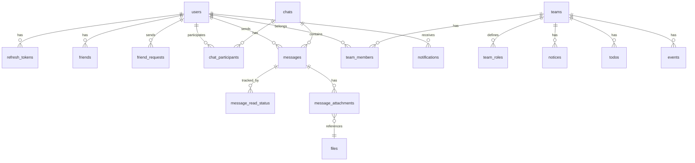

# 🗄️ Agora 프로젝트 - 데이터베이스 스키마

**작성일:** 2025-11-27  
**프로젝트:** Spring Boot + Flutter 메신저 앱  
**데이터베이스:** PostgreSQL

---

## 📋 목차

1. [인증 & 사용자](#1-인증--사용자)
2. [친구 관리](#2-친구-관리)
3. [채팅](#3-채팅)
4. [팀 관리](#4-팀-관리)
5. [팀 기능](#5-팀-기능)
6. [알림](#6-알림)
7. [파일](#7-파일)
8. [보안](#8-보안)
9. [설정](#9-설정)

---

## 1. 인증 & 사용자

### 1.1 users (사용자)

| 컬럼명 | 타입 | 제약조건 | 설명 |
|--------|------|----------|------|
| id | BIGSERIAL | PRIMARY KEY | 사용자 ID |
| email | VARCHAR(100) | PRIMARY KEY | 이메일 |
| profile_image | TEXT | | 프로필 이미지 URL |
| bio | TEXT | | 자기소개 |
| phone | VARCHAR(20) | | 전화번호 |
| birthday | DATE | | 생년월일 |

**인덱스:**
- `idx_users_email` ON (email)
- `idx_users_username` ON (username)
- `idx_users_phone` ON (phone)

## 2. 친구 관리

### 2.1 friends (친구)

| 컬럼명 | 타입 | 제약조건 | 설명 |
|--------|------|----------|------|
| id | BIGSERIAL | PRIMARY KEY | 친구 관계 ID |
| user_id | BIGINT | NOT NULL, FK → users(id) | 사용자 ID |
| friend_id | BIGINT | NOT NULL, FK → users(id) | 친구 ID |
| is_favorite | BOOLEAN | NOT NULL, DEFAULT FALSE | 즐겨찾기 여부 |
| created_at | TIMESTAMP | NOT NULL, DEFAULT NOW() | 친구 추가 시간 |

**제약조건:**
- UNIQUE (user_id, friend_id)
- CHECK (user_id != friend_id)

**인덱스:**
- `idx_friends_user_id` ON (user_id)
- `idx_friends_friend_id` ON (friend_id)

---

### 2.2 friend_requests (친구 요청)

| 컬럼명 | 타입 | 제약조건 | 설명 |
|--------|------|----------|------|
| id | BIGSERIAL | PRIMARY KEY | 요청 ID |
| from_user_id | BIGINT | NOT NULL, FK → users(id) | 요청 보낸 사용자 ID |
| to_user_id | BIGINT | NOT NULL, FK → users(id) | 요청 받은 사용자 ID |
| status | VARCHAR(20) | NOT NULL, DEFAULT 'PENDING' | 상태 (PENDING, ACCEPTED, REJECTED) |
| created_at | TIMESTAMP | NOT NULL, DEFAULT NOW() | 요청 시간 |
| updated_at | TIMESTAMP | NOT NULL, DEFAULT NOW() | 수정 시간 |

**제약조건:**
- UNIQUE (from_user_id, to_user_id)
- CHECK (from_user_id != to_user_id)

**인덱스:**
- `idx_friend_requests_to_user_id` ON (to_user_id)
- `idx_friend_requests_status` ON (status)

---

### 2.3 blocked_users (차단 사용자)

| 컬럼명 | 타입 | 제약조건 | 설명 |
|--------|------|----------|------|
| id | BIGSERIAL | PRIMARY KEY | 차단 ID |
| user_id | BIGINT | NOT NULL, FK → users(id) | 차단한 사용자 ID |
| blocked_user_id | BIGINT | NOT NULL, FK → users(id) | 차단된 사용자 ID |
| created_at | TIMESTAMP | NOT NULL, DEFAULT NOW() | 차단 시간 |

**제약조건:**
- UNIQUE (user_id, blocked_user_id)

**인덱스:**
- `idx_blocked_users_user_id` ON (user_id)

---

## 3. 채팅

### 3.1 chats (채팅방)

| 컬럼명 | 타입 | 제약조건 | 설명 |
|--------|------|----------|------|
| id | BIGSERIAL | PRIMARY KEY | 채팅방 ID |
| type | VARCHAR(20) | NOT NULL | 타입 (DIRECT, GROUP) |
| name | VARCHAR(100) | | 그룹 채팅방 이름 |
| profile_image | TEXT | | 그룹 프로필 이미지 URL |
| read_count | BIGINT | NOT NULL, DEFAULT 1 | 메시지 읽은 사용자 수
| read_enabled | BOOLEAN | NOT NULL, DEFAULT FALSE | 읽음 표시 활성화 여부
| created_by | BIGINT | FK → users(id) | 생성자 ID |
| created_at | TIMESTAMP | NOT NULL, DEFAULT NOW() | 생성 시간 |
| updated_at | TIMESTAMP | NOT NULL, DEFAULT NOW() | 수정 시간 |

**인덱스:**
- `idx_chats_type` ON (type)
- `idx_chats_created_by` ON (created_by)

---

### 3.2 chat_participants (채팅 참여자)

| 컬럼명 | 타입 | 제약조건 | 설명 |
|--------|------|----------|------|
| id | BIGSERIAL | PRIMARY KEY | 참여자 ID |
| chat_id | BIGINT | NOT NULL, FK → chats(id) | 채팅방 ID |
| user_id | BIGINT | NOT NULL, FK → users(id) | 사용자 ID |
| role | VARCHAR(20) | DEFAULT 'MEMBER' | 역할 (ADMIN, MEMBER) |
| is_pinned | BOOLEAN | NOT NULL, DEFAULT FALSE | 채팅방 고정 여부 |
| pinned_at | TIMESTAMP | NULL | 고정한 시간 (정렬용) |
| joined_at | TIMESTAMP | NOT NULL, DEFAULT NOW() | 참여 시간 |

**제약조건:**
- UNIQUE (chat_id, user_id)

**인덱스:**
- `idx_chat_participants_chat_id` ON (chat_id)
- `idx_chat_participants_user_id` ON (user_id)
- `idx_chat_participants_pinned` ON (user_id, is_pinned, pinned_at DESC)

---

### 3.3 messages (메시지)

| 컬럼명 | 타입 | 제약조건 | 설명 |
|--------|------|----------|------|
| id | BIGSERIAL | PRIMARY KEY | 메시지 ID |
| chat_id | BIGINT | NOT NULL, FK → chats(id) | 채팅방 ID |
| sender_id | BIGINT | NOT NULL, FK → users(id) | 발신자 ID |
| content | TEXT | | 메시지 내용 |
| type | VARCHAR(20) | NOT NULL, DEFAULT 'TEXT' | 타입 (TEXT, IMAGE, FILE, SYSTEM) |
| reply_to_id | BIGINT | FK → messages(id) | 답장 대상 메시지 ID |
| is_deleted | BOOLEAN | NOT NULL, DEFAULT FALSE | 삭제 여부 |
| is_pinned | BOOLEAN | NOT NULL, DEFAULT FALSE | 메시지 고정 여부 |
| private_only_user_id | BIGINT | DEFAULT NULL | 특정 사용자에게만 공개 여부 |
| created_at | TIMESTAMP | NOT NULL, DEFAULT NOW() | 생성 시간 |
| updated_at | TIMESTAMP | NOT NULL, DEFAULT NOW() | 수정 시간 |

**인덱스:**
- `idx_messages_chat_id` ON (chat_id)
- `idx_messages_sender_id` ON (sender_id)
- `idx_messages_created_at` ON (created_at DESC)

---

### 3.4 message_attachments (메시지 첨부파일)

| 컬럼명 | 타입 | 제약조건 | 설명 |
|--------|------|----------|------|
| id | BIGSERIAL | PRIMARY KEY | 첨부 ID |
| message_id | BIGINT | NOT NULL, FK → messages(id) | 메시지 ID |
| file_id | BIGINT | NOT NULL, FK → files(id) | 파일 ID |
| order_index | INTEGER | NOT NULL, DEFAULT 0 | 첨부 순서 |
| created_at | TIMESTAMP | NOT NULL, DEFAULT NOW() | 생성 시간 |

**제약조건:**
- UNIQUE (message_id, file_id)

**인덱스:**
- `idx_message_attachments_message_id` ON (message_id)
- `idx_message_attachments_file_id` ON (file_id)

---

### 3.5 message_read_status (메시지 읽음 상태)

| 컬럼명 | 타입 | 제약조건 | 설명 |
|--------|------|----------|------|
| id | BIGSERIAL | PRIMARY KEY | 읽음 상태 ID |
| message_id | BIGINT | NOT NULL, FK → messages(id) | 메시지 ID |
| user_id | BIGINT | NOT NULL, FK → users(id) | 사용자 ID |

**제약조건:**
- UNIQUE (message_id, user_id)

**인덱스:**
- `idx_message_read_status_message_id` ON (message_id)
- `idx_message_read_status_user_id` ON (user_id)

---

### 3.6 chat_folders (채팅 폴더)

| 컬럼명 | 타입 | 제약조건 | 설명 |
|--------|------|----------|------|
| id | BIGSERIAL | PRIMARY KEY | 폴더 ID |
| user_id | BIGINT | NOT NULL, FK → users(id) | 사용자 ID |
| name | VARCHAR(100) | NOT NULL | 폴더명 |
| order_index | INTEGER | NOT NULL, DEFAULT 0 | 정렬 순서 |
| created_at | TIMESTAMP | NOT NULL, DEFAULT NOW() | 생성 시간 |
| updated_at | TIMESTAMP | NOT NULL, DEFAULT NOW() | 수정 시간 |

**인덱스:**
- `idx_chat_folders_user_id` ON (user_id)

---

### 3.7 chat_folder_items (채팅 폴더 아이템)

| 컬럼명 | 타입 | 제약조건 | 설명 |
|--------|------|----------|------|
| id | BIGSERIAL | PRIMARY KEY | 아이템 ID |
| folder_id | BIGINT | NOT NULL, FK → chat_folders(id) | 폴더 ID |
| chat_id | BIGINT | NOT NULL, FK → chats(id) | 채팅방 ID |
| created_at | TIMESTAMP | NOT NULL, DEFAULT NOW() | 추가 시간 |

**제약조건:**
- UNIQUE (folder_id, chat_id)

**인덱스:**
- `idx_chat_folder_items_folder_id` ON (folder_id)
- `idx_chat_folder_items_chat_id` ON (chat_id)

---

## 4. 팀 관리

### 4.1 teams (팀)

| 컬럼명 | 타입 | 제약조건 | 설명 |
|--------|------|----------|------|
| id | BIGSERIAL | PRIMARY KEY | 팀 ID |
| name | VARCHAR(100) | NOT NULL | 팀명 |
| description | TEXT | | 팀 설명 |
| profile_image | TEXT | | 팀 프로필 이미지 URL |
| is_main | BOOLEAN | NOT NULL, DEFAULT FALSE | 메인 팀 여부 |
| created_by | BIGINT | NOT NULL, FK → users(id) | 생성자 ID |
| created_at | TIMESTAMP | NOT NULL, DEFAULT NOW() | 생성 시간 |
| updated_at | TIMESTAMP | NOT NULL, DEFAULT NOW() | 수정 시간 |

**인덱스:**
- `idx_teams_created_by` ON (created_by)

---

### 4.2 team_members (팀원)

| 컬럼명 | 타입 | 제약조건 | 설명 |
|--------|------|----------|------|
| id | BIGSERIAL | PRIMARY KEY | 팀원 ID |
| team_id | BIGINT | NOT NULL, FK → teams(id) | 팀 ID |
| user_id | BIGINT | NOT NULL, FK → users(id) | 사용자 ID |
| role_id | BIGINT | FK → team_roles(id) | 역할 ID |
| position_id | BIGINT | FK → team_positions(id) | 직책 ID |
| joined_at | TIMESTAMP | NOT NULL, DEFAULT NOW() | 가입 시간 |

**제약조건:**
- UNIQUE (team_id, user_id)

**인덱스:**
- `idx_team_members_team_id` ON (team_id)
- `idx_team_members_user_id` ON (user_id)

---

### 4.3 team_roles (팀 역할)

| 컬럼명 | 타입 | 제약조건 | 설명 |
|--------|------|----------|------|
| id | BIGSERIAL | PRIMARY KEY | 역할 ID |
| team_id | BIGINT | NOT NULL, FK → teams(id) | 팀 ID |
| name | VARCHAR(50) | NOT NULL | 역할명 (OWNER, ADMIN, MEMBER) |
| permissions | TEXT | | 권한 목록 (JSON) |
| created_at | TIMESTAMP | NOT NULL, DEFAULT NOW() | 생성 시간 |

**제약조건:**
- UNIQUE (team_id, name)

**인덱스:**
- `idx_team_roles_team_id` ON (team_id)

---

## 5. 팀 기능

### 5.1 notices (공지사항)

| 컬럼명 | 타입 | 제약조건 | 설명 |
|--------|------|----------|------|
| id | BIGSERIAL | PRIMARY KEY | 공지사항 ID |
| team_id | BIGINT | NOT NULL, FK → teams(id) | 팀 ID |
| author_id | BIGINT | NOT NULL, FK → users(id) | 작성자 ID |
| title | VARCHAR(200) | NOT NULL | 제목 |
| content | TEXT | NOT NULL | 내용 |
| is_pinned | BOOLEAN | NOT NULL, DEFAULT FALSE | 상단 고정 여부 |
| created_at | TIMESTAMP | NOT NULL, DEFAULT NOW() | 생성 시간 |
| updated_at | TIMESTAMP | NOT NULL, DEFAULT NOW() | 수정 시간 |

**인덱스:**
- `idx_notices_team_id` ON (team_id)
- `idx_notices_created_at` ON (created_at DESC)

---

### 5.2 todos (할 일)

| 컬럼명 | 타입 | 제약조건 | 설명 |
|--------|------|----------|------|
| id | BIGSERIAL | PRIMARY KEY | 할 일 ID |
| team_id | BIGINT | NOT NULL, FK → teams(id) | 팀 ID |
| created_by | BIGINT | NOT NULL, FK → users(id) | 생성자 ID |
| assigned_to | BIGINT | FK → users(id) | 담당자 ID |
| title | VARCHAR(200) | NOT NULL | 제목 |
| description | TEXT | | 설명 |
| status | VARCHAR(20) | NOT NULL, DEFAULT 'TODO' | 상태 (TODO, IN_PROGRESS, DONE) |
| priority | VARCHAR(20) | DEFAULT 'MEDIUM' | 우선순위 (LOW, MEDIUM, HIGH) |
| due_date | TIMESTAMP | | 마감일 |
| completed_at | TIMESTAMP | | 완료 시간 |
| created_at | TIMESTAMP | NOT NULL, DEFAULT NOW() | 생성 시간 |
| updated_at | TIMESTAMP | NOT NULL, DEFAULT NOW() | 수정 시간 |

**인덱스:**
- `idx_todos_team_id` ON (team_id)
- `idx_todos_assigned_to` ON (assigned_to)
- `idx_todos_status` ON (status)

---

### 5.3 events (일정)

| 컬럼명 | 타입 | 제약조건 | 설명 |
|--------|------|----------|------|
| id | BIGSERIAL | PRIMARY KEY | 일정 ID |
| team_id | BIGINT | NOT NULL, FK → teams(id) | 팀 ID |
| created_by | BIGINT | NOT NULL, FK → users(id) | 생성자 ID |
| title | VARCHAR(200) | NOT NULL | 제목 |
| description | TEXT | | 설명 |
| location | VARCHAR(200) | | 장소 |
| start_time | TIMESTAMP | NOT NULL | 시작 시간 |
| end_time | TIMESTAMP | NOT NULL | 종료 시간 |
| is_all_day | BOOLEAN | NOT NULL, DEFAULT FALSE | 종일 일정 여부 |
| created_at | TIMESTAMP | NOT NULL, DEFAULT NOW() | 생성 시간 |
| updated_at | TIMESTAMP | NOT NULL, DEFAULT NOW() | 수정 시간 |

**인덱스:**
- `idx_events_team_id` ON (team_id)
- `idx_events_start_time` ON (start_time)

---

## 6. 알림

### 6.1 notifications (알림)

| 컬럼명 | 타입 | 제약조건 | 설명 |
|--------|------|----------|------|
| id | BIGSERIAL | PRIMARY KEY | 알림 ID |
| user_id | BIGINT | NOT NULL, FK → users(id) | 사용자 ID |
| type | VARCHAR(50) | NOT NULL | 알림 타입 (MESSAGE, FRIEND_REQUEST, TEAM_INVITE 등) |
| title | VARCHAR(200) | NOT NULL | 제목 |
| content | TEXT | | 내용 |
| related_id | BIGINT | | 관련 엔티티 ID |
| related_type | VARCHAR(50) | | 관련 엔티티 타입 |
| is_read | BOOLEAN | NOT NULL, DEFAULT FALSE | 읽음 여부 |
| created_at | TIMESTAMP | NOT NULL, DEFAULT NOW() | 생성 시간 |

**인덱스:**
- `idx_notifications_user_id` ON (user_id)
- `idx_notifications_is_read` ON (is_read)
- `idx_notifications_created_at` ON (created_at DESC)

---

### 6.2 fcm_tokens (FCM 토큰)

| 컬럼명 | 타입 | 제약조건 | 설명 |
|--------|------|----------|------|
| id | BIGSERIAL | PRIMARY KEY | 토큰 ID |
| user_id | BIGINT | NOT NULL, FK → users(id) | 사용자 ID |
| token | VARCHAR(500) | UNIQUE, NOT NULL | FCM 토큰 |
| device_type | VARCHAR(20) | NOT NULL | 디바이스 타입 (ANDROID, IOS, WEB) |
| device_id | VARCHAR(100) | | 디바이스 ID |
| created_at | TIMESTAMP | NOT NULL, DEFAULT NOW() | 생성 시간 |
| updated_at | TIMESTAMP | NOT NULL, DEFAULT NOW() | 수정 시간 |

**인덱스:**
- `idx_fcm_tokens_user_id` ON (user_id)
- `idx_fcm_tokens_token` ON (token)

---

## 7. 파일

### 7.1 files (파일)

| 컬럼명 | 타입 | 제약조건 | 설명 |
|--------|------|----------|------|
| id | BIGSERIAL | PRIMARY KEY | 파일 ID |
| uploaded_by | BIGINT | NOT NULL, FK → users(id) | 업로드한 사용자 ID |
| file_name | VARCHAR(255) | NOT NULL | 파일명 |
| original_name | VARCHAR(255) | NOT NULL | 원본 파일명 |
| file_path | TEXT | NOT NULL | 파일 경로 |
| file_url | TEXT | NOT NULL | 파일 URL |
| thumbnail_url | TEXT | | 썸네일 URL (이미지인 경우) |
| file_size | BIGINT | NOT NULL | 파일 크기 (bytes) |
| mime_type | VARCHAR(100) | NOT NULL | MIME 타입 |
| file_type | VARCHAR(20) | NOT NULL | 파일 타입 (IMAGE, VIDEO, DOCUMENT, OTHER) |
| created_at | TIMESTAMP | NOT NULL, DEFAULT NOW() | 업로드 시간 |

**인덱스:**
- `idx_files_uploaded_by` ON (uploaded_by)
- `idx_files_file_type` ON (file_type)

---

### 7.2 file_metadata (파일 메타데이터)

| 컬럼명 | 타입 | 제약조건 | 설명 |
|--------|------|----------|------|
| id | BIGSERIAL | PRIMARY KEY | 메타데이터 ID |
| file_id | BIGINT | NOT NULL, FK → files(id) | 파일 ID |
| width | INTEGER | | 이미지 너비 |
| height | INTEGER | | 이미지 높이 |
| duration | INTEGER | | 비디오 길이 (초) |
| metadata | TEXT | | 추가 메타데이터 (JSON) |

**제약조건:**
- UNIQUE (file_id)

---

## 8. 보안

### 8.1 user_sessions (사용자 세션)

| 컬럼명 | 타입 | 제약조건 | 설명 |
|--------|------|----------|------|
| id | VARCHAR(255) | PRIMARY KEY | 세션 ID (UUID) |
| user_id | BIGINT | NOT NULL, FK → users(id) | 사용자 ID |
| device_type | VARCHAR(50) | | 디바이스 타입 |
| device_name | VARCHAR(100) | | 디바이스 이름 |
| ip_address | VARCHAR(50) | | IP 주소 |
| location | VARCHAR(100) | | 위치 |
| user_agent | TEXT | | User Agent |
| last_active_at | TIMESTAMP | NOT NULL, DEFAULT NOW() | 마지막 활동 시간 |
| created_at | TIMESTAMP | NOT NULL, DEFAULT NOW() | 생성 시간 |

**인덱스:**
- `idx_user_sessions_user_id` ON (user_id)
- `idx_user_sessions_last_active_at` ON (last_active_at)

---

### 8.2 two_factor_auth (2단계 인증)

| 컬럼명 | 타입 | 제약조건 | 설명 |
|--------|------|----------|------|
| id | BIGSERIAL | PRIMARY KEY | 2FA ID |
| user_id | BIGINT | UNIQUE, NOT NULL, FK → users(id) | 사용자 ID |
| secret_key | VARCHAR(255) | NOT NULL | TOTP 시크릿 키 |
| backup_codes | TEXT | | 백업 코드 (JSON 배열) |
| enabled_at | TIMESTAMP | NOT NULL, DEFAULT NOW() | 활성화 시간 |

---

### 8.3 login_history (로그인 기록)

| 컬럼명 | 타입 | 제약조건 | 설명 |
|--------|------|----------|------|
| id | BIGSERIAL | PRIMARY KEY | 기록 ID |
| user_id | BIGINT | NOT NULL, FK → users(id) | 사용자 ID |
| ip_address | VARCHAR(50) | | IP 주소 |
| location | VARCHAR(100) | | 위치 |
| device_type | VARCHAR(50) | | 디바이스 타입 |
| user_agent | TEXT | | User Agent |
| success | BOOLEAN | NOT NULL | 성공 여부 |
| failure_reason | VARCHAR(100) | | 실패 사유 |
| created_at | TIMESTAMP | NOT NULL, DEFAULT NOW() | 로그인 시도 시간 |

**인덱스:**
- `idx_login_history_user_id` ON (user_id)
- `idx_login_history_created_at` ON (created_at DESC)

---

## 9. 설정

### 9.1 user_settings (사용자 설정)

| 컬럼명 | 타입 | 제약조건 | 설명 |
|--------|------|----------|------|
| id | BIGSERIAL | PRIMARY KEY | 설정 ID |
| user_id | BIGINT | UNIQUE, NOT NULL, FK → users(id) | 사용자 ID |
| push_enabled | BOOLEAN | NOT NULL, DEFAULT TRUE | 푸시 알림 활성화 |
| message_notification | BOOLEAN | NOT NULL, DEFAULT TRUE | 메시지 알림 |
| friend_request_notification | BOOLEAN | NOT NULL, DEFAULT TRUE | 친구 요청 알림 |
| team_notification | BOOLEAN | NOT NULL, DEFAULT TRUE | 팀 알림 |
| notice_notification | BOOLEAN | NOT NULL, DEFAULT TRUE | 공지사항 알림 |
| sound_enabled | BOOLEAN | NOT NULL, DEFAULT TRUE | 알림 소리 |
| vibration_enabled | BOOLEAN | NOT NULL, DEFAULT TRUE | 진동 |
| do_not_disturb_start | TIME | | 방해 금지 시작 시간 |
| do_not_disturb_end | TIME | | 방해 금지 종료 시간 |
| profile_visibility | VARCHAR(20) | DEFAULT 'FRIENDS' | 프로필 공개 범위 (PUBLIC, FRIENDS, NONE) |
| phone_visibility | VARCHAR(20) | DEFAULT 'NONE' | 전화번호 공개 범위 |
| birthday_visibility | VARCHAR(20) | DEFAULT 'FRIENDS' | 생일 공개 범위 |
| allow_friend_requests | BOOLEAN | NOT NULL, DEFAULT TRUE | 친구 요청 허용 |
| allow_group_invites | BOOLEAN | NOT NULL, DEFAULT TRUE | 그룹 초대 허용 |
| show_online_status | BOOLEAN | NOT NULL, DEFAULT TRUE | 온라인 상태 표시 |
| login_notification | BOOLEAN | NOT NULL, DEFAULT TRUE | 로그인 알림 |
| session_timeout | INTEGER | DEFAULT 30 | 세션 타임아웃 (분) |
| birthday_reminder_enabled | BOOLEAN | NOT NULL, DEFAULT TRUE | 생일 알림 활성화 |
| birthday_reminder_days_before | INTEGER | DEFAULT 3 | 생일 며칠 전 알림 |
| created_at | TIMESTAMP | NOT NULL, DEFAULT NOW() | 생성 시간 |
| updated_at | TIMESTAMP | NOT NULL, DEFAULT NOW() | 수정 시간 |

---

## 📊 테이블 요약

| 카테고리 | 테이블 수 | 테이블 목록 |
|----------|-----------|-------------|
| 인증 & 사용자 | 5 | users, refresh_tokens, email_verification_tokens, password_reset_tokens, sms_verification_codes |
| 친구 관리 | 3 | friends, friend_requests, blocked_users |
| 채팅 | 7 | chats, chat_participants, messages, message_attachments, message_read_status, chat_folders, chat_folder_items |
| 팀 관리 | 5 | teams, team_members, team_roles, team_positions, org_chart_nodes |
| 팀 기능 | 3 | notices, todos, events |
| 알림 | 2 | notifications, fcm_tokens |
| 파일 | 2 | files, file_metadata |
| 보안 | 3 | user_sessions, two_factor_auth, login_history |
| 설정 | 1 | user_settings |

**총 테이블 수:** 31개

---

## 🔗 주요 관계도

---

**작성자:** Antigravity AI Assistant  
**최종 수정:** 2025-11-27  
**버전:** 1.0
